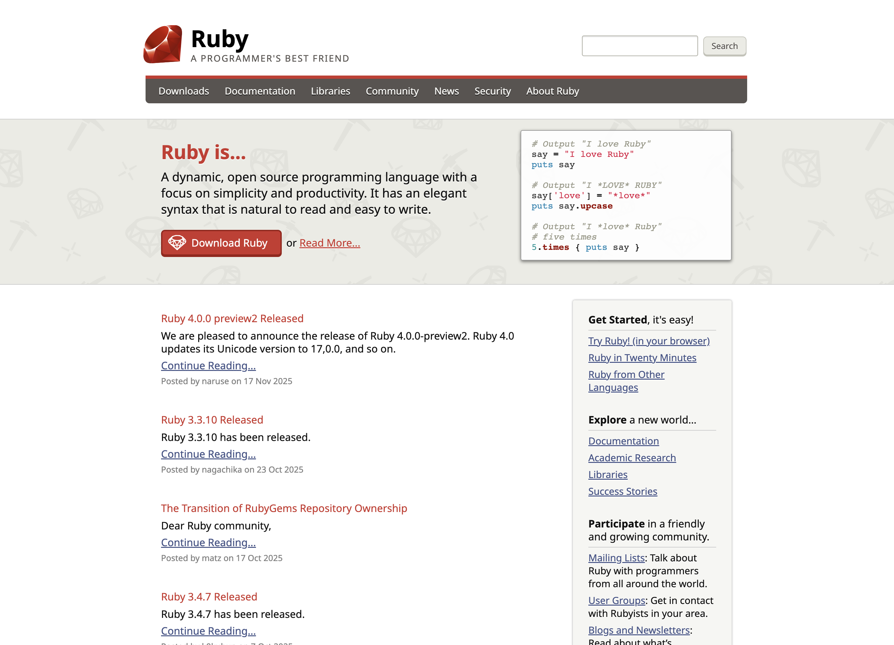
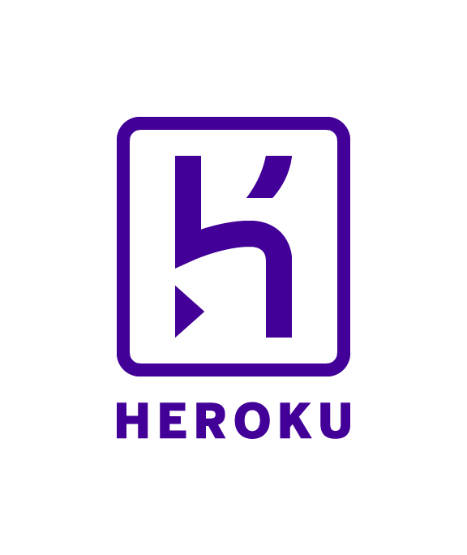

Ce site web est généré avec Ruby en utilisant [Jekyll][jekyll], 
son code source est hébergé sur [GitHub][github-repo].

## Design

Le design visuel actuel est réalisé par [Taeko Akatsuka][akatsuka].
Le site a été renouvelé en décembre 2025.

Design visuel avant décembre 2025 par [Jason Zimdars][jzimdars]. 
Basé sur un design antérieur du Ruby Visual Identity Team.

## Logo

Le [logo Ruby][logo] est sous Copyright &copy; 2006, Yukihiro Matsumoto.

## Signaler des problèmes ##

Pour signaler un problème, utilisez le [système de suivi des problèmes][github-issues]
ou contactez notre [webmaster][webmaster] (en anglais).

## Comment contribuer ##

Ce site web est fièrement maintenu par des membres de la communauté Ruby.

Si vous souhaitez contribuer, lisez les [instructions de contribution][github-wiki]
et commencez simplement à ouvrir des issues ou des pull requests !

## Remerciements ##

Merci à tous les commiters, auteurs, traducteurs et autres contributeurs
de ce site web.

Nous remercions également les organisations qui nous soutiennent :

<table class="not-prose sponsor-table">
  <tr>
    <td><a href="http://www.ruby.or.jp">Ruby Association</a> (hébergement)</td>
    <td class="sponsor-logo"></td>
  </tr>
  <tr>
    <td><a href="http://ruby-no-kai.org/">Ruby no Kai</a> (serveur de build)</td>
    <td class="sponsor-logo"></td>
  </tr>
  <tr>
    <td><a href="https://aws.amazon.com/">AWS</a> (hébergement)</td>
    <td class="sponsor-logo"></td>
  </tr>
  <tr>
    <td><a href="https://www.heroku.com/">Heroku</a> (hébergement)</td>
    <td class="sponsor-logo"></td>
  </tr>
  <tr>
    <td><a href="https://www.ibm.com/">IBM</a> (hébergement)</td>
    <td class="sponsor-logo"></td>
  </tr>
  <tr>
    <td><a href="http://www.fastly.com">Fastly</a> (CDN)</td>
    <td class="sponsor-logo"></td>
  </tr>
  <tr>
    <td><a href="http://hatenacorp.jp/">Hatena</a> (<a href="https://mackerel.io/">Mackerel</a>, surveillance du serveur)</td>
    <td class="sponsor-logo"></td>
  </tr>
  <tr>
    <td><a href="https://www.datadoghq.com/">Datadog</a> (surveillance du serveur)</td>
    <td class="sponsor-logo"></td>
  </tr>
  <tr>
    <td><a href="https://1password.com/">1Password</a> (gestionnaire de mots de passe)</td>
    <td class="sponsor-logo"></td>
  </tr>
</table>

[logo]: /fr/about/logo/
[webmaster]: mailto:webmaster@ruby-lang.org
[jekyll]: http://www.jekyllrb.com/
[akatsuka]: https://x.com/ken_c_lo
[jzimdars]: https://twitter.com/jasonzimdars
[github-repo]: https://github.com/ruby/www.ruby-lang.org/
[github-issues]: https://github.com/ruby/www.ruby-lang.org/issues
[github-wiki]: https://github.com/ruby/www.ruby-lang.org/wiki
