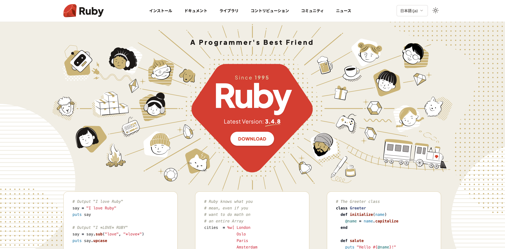
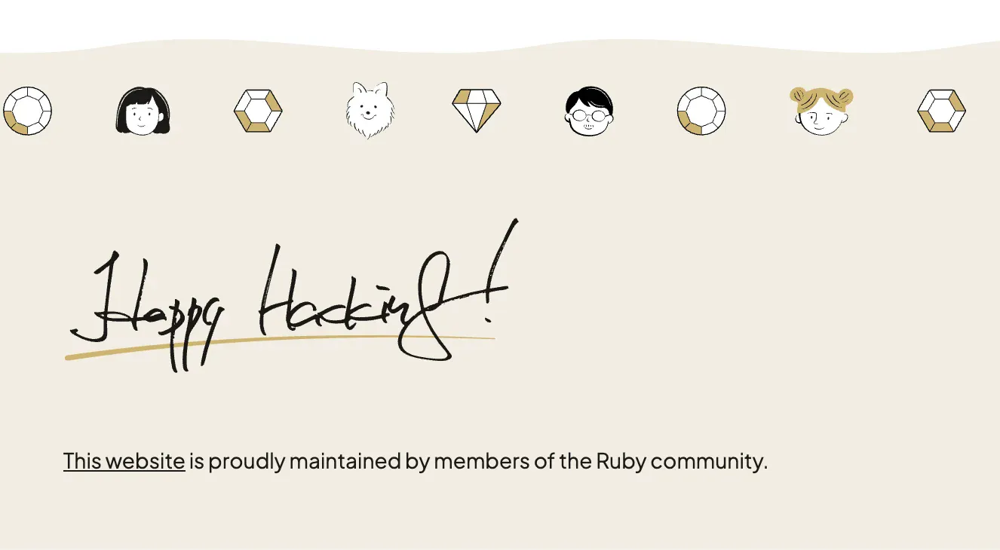

이 웹 사이트는 Ruby와 [Jekyll][jekyll]로 생성되었고, 
소스코드는 [GitHub][github-repo]에서 호스트 됩니다.

## 디자인

현재 비주얼 디자인은 [Taeko Akatsuka][akatsuka] 님이 담당했습니다.
2025년 12월에 사이트가 리뉴얼되었습니다.

하단의 "Happy Hacking"은 [마츠모토 유키히로(Matz)][matz] 님의 친필입니다.

## 이전 디자인

2025년 12월 이전의 비주얼 디자인은 Ruby Visual Identity 팀의 이전 디자인을 기초로
[Jason Zimdars][jzimdars] 님이 디자인했습니다.

## 로고

[Ruby 로고][logo]의 저작권은 &copy; 2006, 마츠모토
유키히로에게 있습니다.

## 문제 보고하기 ##

문제를 보고하시려면 [이슈 트래커][github-issues]를
이용하시거나 [웹 마스터][webmaster]에게 연락해주세요.
(영어여야 합니다.)

## 기여하기 ##

이 사이트는 Ruby 커뮤니티의 구성원들이 직접 관리합니다.

기여하시길 원하시면 먼저 [contribution instructions][github-wiki]를
읽으시고 이슈를 만들거나 풀 리퀘스트를 보내주시면 됩니다.

## 감사의 말 ##

모든 이 웹 사이트의 커미터, 작가, 번역자, 그 밖의 기여자분들에게
감사드립니다.

지원해주신 단체들에게도 감사드립니다.

<table class="not-prose sponsor-table">
  <tr>
    <td><a href="http://www.ruby.or.jp">Ruby Association</a> (호스팅)</td>
    <td class="sponsor-logo"></td>
  </tr>
  <tr>
    <td><a href="http://ruby-no-kai.org/">Ruby no Kai</a> (빌드 서버)</td>
    <td class="sponsor-logo"></td>
  </tr>
  <tr>
    <td><a href="https://aws.amazon.com/">AWS</a> (호스팅)</td>
    <td class="sponsor-logo"></td>
  </tr>
  <tr>
    <td><a href="https://www.heroku.com/">Heroku</a> (호스팅)</td>
    <td class="sponsor-logo"></td>
  </tr>
  <tr>
    <td><a href="https://www.ibm.com/">IBM</a> (호스팅)</td>
    <td class="sponsor-logo"></td>
  </tr>
  <tr>
    <td><a href="http://www.fastly.com">Fastly</a> (CDN)</td>
    <td class="sponsor-logo"></td>
  </tr>
  <tr>
    <td><a href="http://hatenacorp.jp/">Hatena</a> (<a href="https://mackerel.io/">Mackerel</a>, 서버 모니터링)</td>
    <td class="sponsor-logo"></td>
  </tr>
  <tr>
    <td><a href="https://www.datadoghq.com/">Datadog</a> (서버 모니터링)</td>
    <td class="sponsor-logo"></td>
  </tr>
  <tr>
    <td><a href="https://1password.com/">1Password</a> (비밀번호 관리자)</td>
    <td class="sponsor-logo"></td>
  </tr>
</table>

[logo]: /ko/about/logo/
[webmaster]: mailto:webmaster@ruby-lang.org
[jekyll]: http://www.jekyllrb.com/
[akatsuka]: https://x.com/ken_c_lo
[matz]: https://x.com/yukihiro_matz
[jzimdars]: https://twitter.com/jasonzimdars
[github-repo]: https://github.com/ruby/www.ruby-lang.org/
[github-issues]: https://github.com/ruby/www.ruby-lang.org/issues
[github-wiki]: https://github.com/ruby/www.ruby-lang.org/wiki
