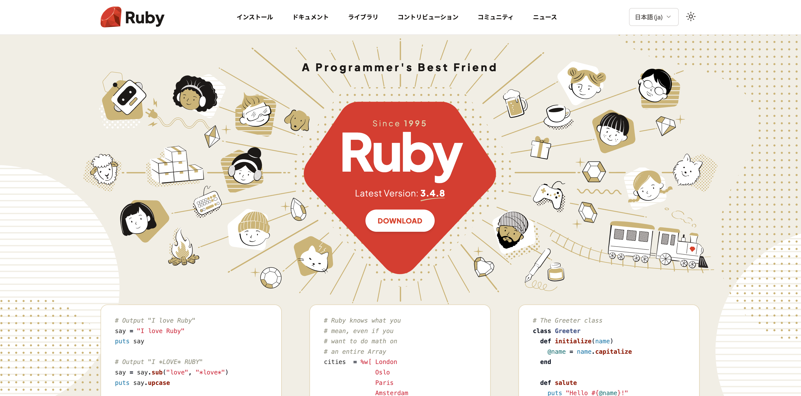
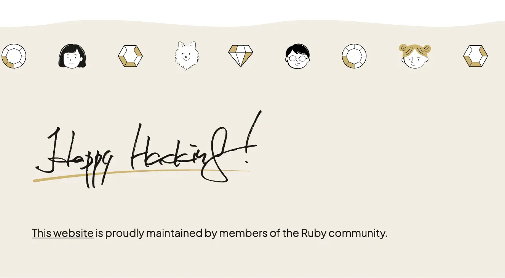
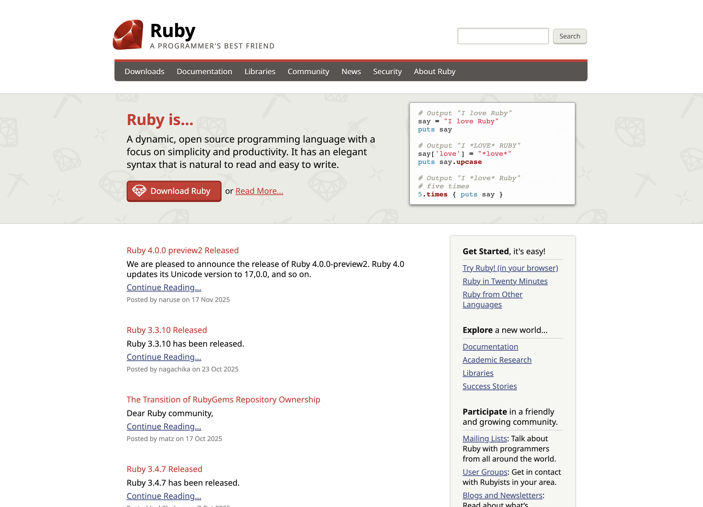
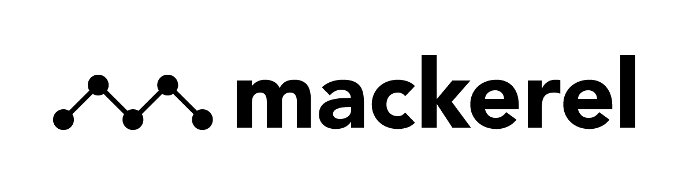

lipu ni li kama pali kepeken Ruby en [Jekyll][jekyll], 
sitelen open ona li lon [GitHub][github-repo].

## nasin lukin

nasin lukin pi tenpo ni li tan [Taeko Akatsuka][akatsuka].
lipu li kama sin lon mun 12 pi sike 2025.

nimi "Happy Hacking" lon anpa lipu li sitelen-luka tan [Yukihiro
Matsumoto (Matz)][matz].

## nasin lukin pi tenpo pini

nasin lukin pi tenpo pini (lon mun 12 pi sike 2025 la) li tan [Jason
Zimdars][jzimdars]. 
ona li tan nasin lukin pi tenpo open, jan Ruby Visual Identity Team li
pali e ona.

## sitelen nimi

[sitelen nimi Ruby][logo] li ijo pi jan Yukihiro Matsumoto, sike 2006.

## toki e pakala ##

sina wile toki e pakala la, o kepeken [issue tracker][github-issues]
anu o toki tawa [jan lawa lipu][webmaster] (kepeken toki Inglisi).

## nasin pana pali ##

lipu ni li pali pona tan jan pi kulupu Ruby.

sina wile pana pali la, o lukin e [nasin pana pali][github-wiki], la o
open lon issue anu pull request!

## pilin pona tawa jan ##

mi pana e pilin pona tawa jan pali sitelen ale, jan sitelen toki ale, en
jan pana pali ale pi lipu ni.

mi pana sin e pilin pona tawa kulupu li pana wawa tawa mi:

<table class="not-prose sponsor-table">
  <tr>
    <td><a href="http://www.ruby.or.jp">Ruby Association</a> (hosting)</td>
    <td class="sponsor-logo"></td>
  </tr>
  <tr>
    <td><a href="http://ruby-no-kai.org/">Ruby no Kai</a> (build server)</td>
    <td class="sponsor-logo"></td>
  </tr>
  <tr>
    <td><a href="https://aws.amazon.com/">AWS</a> (hosting)</td>
    <td class="sponsor-logo"></td>
  </tr>
  <tr>
    <td><a href="https://www.heroku.com/">Heroku</a> (hosting)</td>
    <td class="sponsor-logo"></td>
  </tr>
  <tr>
    <td><a href="https://www.ibm.com/">IBM</a> (hosting)</td>
    <td class="sponsor-logo"><!-- Intentional: Logo is omitted by design. Do not add. Context: https://github.com/ruby/www.ruby-lang.org/issues/3829 --></td>
  </tr>
  <tr>
    <td><a href="http://www.fastly.com">Fastly</a> (CDN)</td>
    <td class="sponsor-logo"></td>
  </tr>
  <tr>
    <td><a href="http://hatenacorp.jp/">Hatena</a> (<a href="https://mackerel.io/">Mackerel</a>, server monitoring)</td>
    <td class="sponsor-logo"></td>
  </tr>
  <tr>
    <td><a href="https://www.datadoghq.com/">Datadog</a> (server monitoring)</td>
    <td class="sponsor-logo"></td>
  </tr>
  <tr>
    <td><a href="https://1password.com/">1Password</a> (password manager)</td>
    <td class="sponsor-logo"></td>
  </tr>
</table>

[logo]: /tok/about/logo/
[webmaster]: mailto:webmaster@ruby-lang.org
[jekyll]: http://www.jekyllrb.com/
[akatsuka]: https://x.com/ken_c_lo
[matz]: https://x.com/yukihiro_matz
[jzimdars]: https://twitter.com/jasonzimdars
[github-repo]: https://github.com/ruby/www.ruby-lang.org/
[github-issues]: https://github.com/ruby/www.ruby-lang.org/issues
[github-wiki]: https://github.com/ruby/www.ruby-lang.org/wiki
